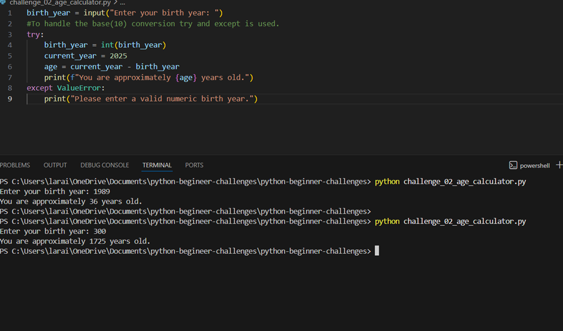
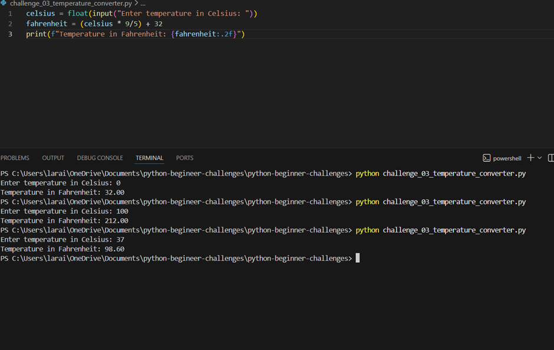
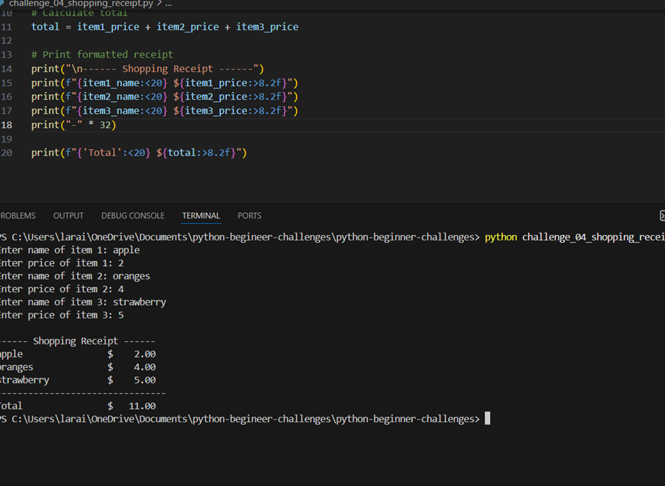
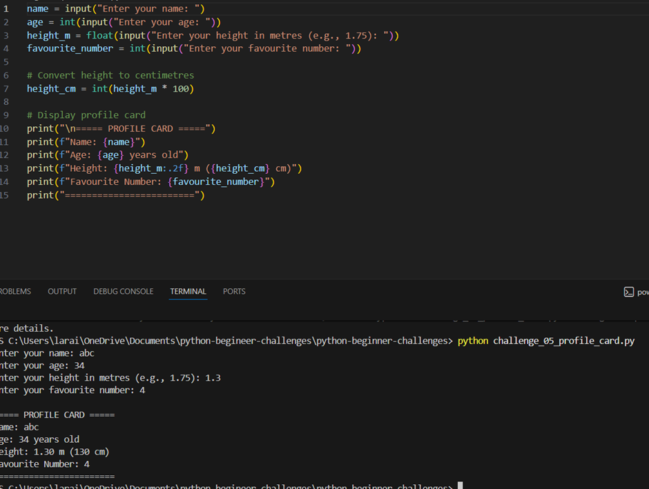

# Python Beginner Challenges

5 beginner-friendly Python challenges covering user input, string formatting, data types and data casting.

## Challenges

| # | Challenge | Branch | Status |
|---|-----------|--------|--------|
| 1 | Personalised Greeting | `challenge/01-greeting` |  Done |
| 2 | Age Calculator | `challenge/02-age-calculator` |  Done |
| 3 | Temperature Converter | `challenge/03-temperature-converter` | Done |
| 4 | Shopping Receipt | `challenge/04-shopping-receipt` | Done |
| 5 | Profile Card | `challenge/05-profile-card` |  Done |

## Outputs
 Personalised Greeting
 
 
 Age Calculator

Temperature Converter 

Shopping Receipt

Profile Card
